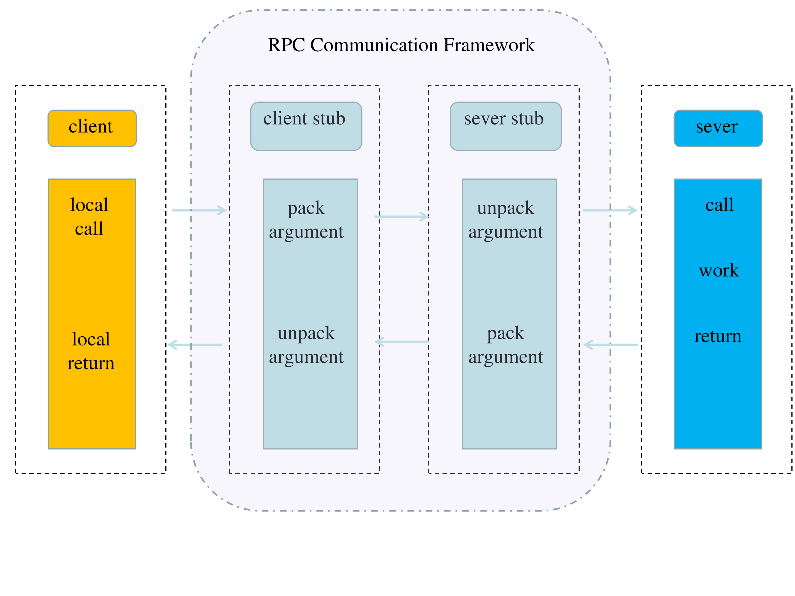

# Distributed RPC Communication Framework

>zh_CN [简体中文](./readme/README.zh_CN.md) 

This project is a distributed RPC communication framework based on the powerful open source network library Muduo and the data serialization library protobuf, which implements communication and invocation of remote services in distributed systems.

## Environment configuration
1. Linux System environment：ubuntu20.04
2. Build high-performance, reliable server applications：[boost库 + muduo库](https://blog.csdn.net/m0_46392035/article/details/124502811)
3. For data serialization and deserialization in C++：[protobuf](https://github.com/protocolbuffers/protobuf)
4. 分布式协调服务：[zookeeper](https://blog.csdn.net/weixin_43559950/article/details/118890904)

## Feature points
1. Use the muduo network library to implement high-concurrency RPC synchronous call request processing
2. Using Protobuf for serialization and deserialization of RPC method calls and parameters
3. Asynchronous log output based on thread-safe buffer queue
4. Use zookeeper as service governance middleware to provide service registration and service discovery functions
